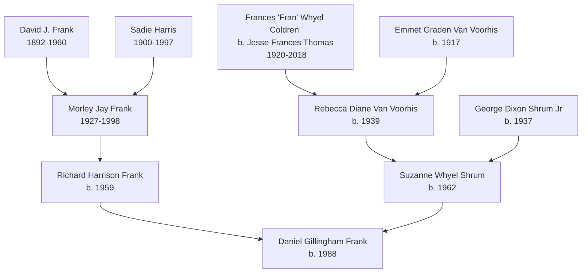

# Family Tree

The documentary genealogical record of Dan Frank's ancestry, derived from an Ancestry.com GEDCOM file containing 515 individuals and 218 families, establishes a deep regional concentration in Fayette County, Pennsylvania, and traces a dual heritage: maternal Appalachian roots and a paternal Eastern European Jewish immigrant lineage. Parsed across 7 generations, the GEDCOM identifies 90 direct ancestors and 16 European-born forebears, with documented birth/death/residence events spanning from the late 1700s to the present.

## Scope of the GEDCOM

| Metric | Value |
|---|---|
| Total individuals | 515 |
| Total families | 218 |
| Direct ancestors traced | 90 |
| European-born ancestors | 14 (corrected) |
| Generations traced | 7 |
| Birth/death/residence events | ~400+ |

## Immediate Family Table

| Relation | Name | Birth/Death | Place | Wiki Link |
|---|---|---|---|---|
| Self | Daniel Gillingham Frank | 1988-11-01 | Uniontown, Fayette, PA | — |
| Father | Richard Harrison "Rick" Frank | 1959-05-22 | Uniontown, PA | [[wiki/people/rick-frank]] |
| Mother | Suzanne Whyel /Shrum/ Frank ("Suz") | 1962-09-15 | Pittsburgh, PA | [[wiki/people/suzanne-frank]] |
| Sister | Vanessa C. Frank | 1994-01-16 | Greensburg, PA | [[wiki/people/vanessa-frank]] |
| Paternal Grandfather | Morley Jay Frank | 1927-08-20 – 1998-12-13 | Brownsville – Hopwood, PA | [[wiki/people/morley-frank]] |
| Paternal Great-Grandfather | David J. Frank | 1892-08-12 – 1960-04-06 | Russia – Brownsville, PA | [[wiki/people/david-j-frank]] |
| Paternal Great-Grandmother | Sadie Harris | 1900-12-14 – 1997-11-27 | Austria – Hopwood, PA | [[wiki/people/sadie-harris]] |
| Maternal Great-Grandmother | Frances "Fran" Whyel Coldren (b. Jesse Frances **Thomas**) | 1920-08-15 – 2018-04-04 | Fort Martin, WV – Uniontown, PA | [[wiki/people/fran-coldren]] |
| Maternal Great-Grandfather | Emmet Graden Van Voorhis (Fran's **first** husband) | 1917-08-01 | Dilliner, PA | — |
| Maternal Grandmother | Rebecca Diane Van Voorhis ("Diane") — **Fran's daughter** | 1939-01-30 | West Virginia | [[wiki/people/diane-moore]] |
| Maternal Grandfather | George Dixon Shrum Jr (Diane's **first** husband; married *into* the line) | 1937-06-14 | Pittsburgh, PA | — |
| Grandmother's second husband | Dave Moore | — | — | [[wiki/people/dave-moore]] |

## Paternal Jewish Immigrant Heritage

David J. Frank (b. 1892, Russia) and Sadie Harris (b. 1900, Austria) immigrated to the US and settled in Pennsylvania, forming the paternal line: David J. Frank + Sadie Harris → Morley → Rick → Dan. This structural record confirms the core biographical context: "Paternal line Jewish; father Episcopalian, mother Presbyterian. Jewish heritage is load-bearing to his politics."

### The Frank Patrilineal Line (5 generations)

| Generation | Name | Birth | Death |
|---|---|---|---|
| 2 | Morley Jay Frank | 20 Aug 1927, Brownsville, PA | 13 Dec 1998, Hopwood, PA |
| 3 | David J Frank | 12 Aug 1892, **Russia** | 06 Apr 1960, Brownsville, PA |
| 4 | Max Frank | abt 1860, New York | 05 Oct 1941, NYC |
| 5 | Henry Frank | abt 1815, **Germany** | 15 Apr 1901, Manhattan |
| 6 | Dorothea Christiana Charlotta Francken | 1 Juli 1781 | — |

**Migration corridor:** Russia → Manhattan (1900) → Bronx (1915) → Brownsville, PA (1920)

The Frank family's presence in New York City extends to at least 1843 (Henry Frank), placing them in the pre-Civil War Ashkenazi immigrant wave rather than the later 1880–1920 wave. Henry Frank's 50+ year residence in New York City, from at least 1843 until his death in 1901, establishes the family as early Ashkenazi immigrants who arrived before the major pogrom-era influx.

### The Harris Matrilineal Line (Sadie's mother's line — 5 generations)

| Generation | Name | Birth | Death |
|---|---|---|---|
| 2 | Gay Gillingham | 1 Jul 1939, PA | — |
| 3 | FRANCIS GILLINGHAM | abt 1903, PA | 07 Jan 1956 |
| 4 | Lillie Diwins | abt 1871, PA | — |
| 5 | Susannah Elizabeth Emerick | 18 Apr 1848, Allegheny Co, PA | — |
| 6 | Nancy "Annie" Wikert | 18 Dec 1828, Lom Kinston Co, PA | — |

**Note:** The GEDCOM does NOT trace the Harris paternal line beyond Sadie Harris herself. Her father is listed only as "Harris" from Czechoslovakia — no given name, no birth date, no immigration record, no residence history. This man contributed ~12.5% of Dan's DNA but is completely undocumented beyond a single datum.

## Maternal Lines (Appalachian Heritage)

### The Shrum Patrilineal Line (4 generations)

| Generation | Name | Birth | Death |
|---|---|---|---|
| 2 | George Dixon Shrum Jr | abt 1937, PA | — |
| 3 | G Dixon Shrum | abt 1896, PA | 1960, Pittsburgh |
| 4 | Daniel E Shrum Jr | abt 1846, PA | — |
| 5 | Reuben Shrum | 1818, PA | — |

**Geographic concentration:** Westmoreland County → Allegheny County (Pittsburgh)

### The Van Voorhis/Thomas/Coldren Matrilineal Line (6 generations)

| Generation | Name | Birth | Death |
|---|---|---|---|
| 2 | Rebecca Diane Van Voorhis Jr | 30 Jan 1939, WV | — |
| 3 | Jesse Frances Thomas Whyel Coldren | 15 Aug 1920, Fort Martin, WV | 04 Apr 2018, Uniontown, PA |
| 4 | Ida Ellen Conwell | 14 Aug 1880, WV | — |
| 5 | Susan A Zearly | 01 Feb 1845, WV | — |
| 6 | Amelia | abt 1813, WV | — |

**Geographic concentration:** Monongalia Co, WV → Fayette Co, PA

## Geographic Concentration

The family history demonstrates a heavy residential concentration in Fayette County (Uniontown, Brownsville, Hopwood, Champion) across generations.

### US State Counts (birth/death/burial/residence)

| State | Instances |
|---|---|
| Pennsylvania | 45 |
| West Virginia | 5 |
| New York | 4 |
| Florida | 2 |
| North Carolina | 1 |

### Pennsylvania Cities/Counties

| City/County | Count |
|---|---|
| Fayette | 9 |
| Allegheny | 9 |
| Fayette County | 7 |
| Somerset | 7 |
| Westmoreland County | 5 |
| Greene | 5 |
| Westmoreland | 4 |
| Hopwood | 2 |
| Washington | 2 |
| Bedford County | 2 |
| Allegheny County | 2 |
| Beaver | 2 |
| Beaver County | 2 |
| Uniontown | 1 |
| Bucks County | 1 |
| Indiana | 1 |
| Westmorland Co | 1 |
| Dilliner | 1 |
| Washington County | 1 |
| Clearfield | 1 |
| Dunkard Township | 1 |
| Dunkard | 1 |
| Somerset County | 1 |

### West Virginia Cities/Counties

| City/County | Count |
|---|---|
| Monongalia County | 5 |
| Monongalia | 4 |
| Morgantown | 2 |
| Fort Martin Rd | 1 |

### New York Cities/Counties

| City/County | Count |
|---|---|
| New York City | 2 |
| Manhattan | 1 |

## European-Born Ancestors (14 corrected)

After correcting for place name parsing errors (Susannah Elizabeth Emerick and William Preston Gillingham were incorrectly flagged as European-born because their birthplaces lacked "USA"), the true European-born count is **14 individuals**:

| Name | Birthplace | Date | Line |
|---|---|---|---|
| David J Frank | Russia | 12 Aug 1892 | Paternal GF |
| Sadie Harris | Austria | 14 Dec 1900 | Paternal GM |
| Harris | Czechoslovakia | — | Paternal GM (Sadie's father) |
| Henry Frank | Germany | abt 1815 | Paternal GF (5 gen) |
| Hannah Frank | Gunzenhausen | 1818 | Paternal GF (5 gen) |
| Meyer Cohen | Germany | — | Paternal GM (5 gen) |
| Bertha Cohen | Germany | — | Paternal GM (5 gen) |
| Andrew Jenkins | Larbert, Stirling, Scotland | 12 Nov 1818 | Maternal GM (6 gen) |
| Jane Hunter | Scotland | abt 1821 | Maternal GM (6 gen) |
| Robert Turley | Scotland | abt 1839 | Paternal GM (5 gen) |
| Rachael Jenkins | Scotland | abt 1842 | Paternal GM (5 gen) |
| Mary E. Lewellen | Monongalia co., WV | 08 Mar 1837 | Paternal GM (5 gen) |
| Hezekiah Thomas | Monongalia, W VA | abt 1807 | Maternal GM (6 gen) |

**Note:** The Germany-born ancestors (Henry Frank, Hannah Frank, Meyer Cohen, Bertha Cohen) are on **collateral** lines — they are siblings or spouses of direct ancestors, not direct ancestors themselves, and contribute 0% of Dan's autosomal DNA. Only 3 European-born individuals are on direct parental lines: David J. Frank (Russia), Sadie Harris (Austria), and Harris (Czechoslovakia).

## Surname Frequencies (Top 30 of 515 individuals)

| Surname | Count |
|---|---|
| Frank | 53 |
| Coldren | 38 |
| Thomas | 35 |
| Lincoln | 31 |
| Gillingham | 28 |
| Shrum | 25 |
| Lewellen | 14 |
| Newcomer | 12 |
| Gapen | 12 |
| Conwell | 10 |
| Jenkins | 8 |
| Van Voorhis | 8 |
| Whyel | 8 |
| Burgan | 8 |
| Staylor | 8 |
| Emerick | 7 |
| Dryer | 6 |
| Muir | 5 |
| Divvens | 5 |
| Krehbiel | 5 |
| Rush | 5 |
| Klein | 5 |
| Baker | 4 |
| Tibbs | 4 |
| Herncane | 4 |
| Wolfram | 4 |
| Zearly | 3 |
| Welty | 3 |
| Tangarone | 3 |

The high frequency of Coldren (38), Thomas (35), Lincoln (31), and Newcomer (12) reflects the extensive documentation of collateral lines — cousins, siblings, and spouses who intermarried within the same Fayette County / Monongalia County communities over generations.

## Migration Corridors

Six distinct migration corridors are documented in the ancestry:

1. **Russia → Manhattan (1900) → Bronx (1915) → Brownsville, PA (1920)** — David J. Frank's path: immigration → NYC → Fayette County. The family lived in Manhattan for at least 20 years before moving to Pennsylvania.

2. **Austria → Brownsville, PA (by 1920)** — Sadie Harris's path: apparently direct to Fayette County, though her father "Harris" is listed as born in Czechoslovakia, suggesting the family may have been displaced within Eastern Europe before immigration.

3. **Germany → Manhattan (1815+) → died Manhattan 1901** — Henry Frank's path: early Ashkenazi immigrant (pre-Civil War wave), lived in New York City for over 50 years, died there. His son Max Frank (b. abt 1860, NY) continued the NYC residency through at least 1940.

4. **Scotland → PA/WV (1700s–1800s)** — Andrew Jenkins (b. 1818, Larbert, Stirling, Scotland), Robert Turley (b. abt 1839, Scotland), Rachael Jenkins (b. abt 1842, Scotland), and Jane Hunter (b. abt 1821, Scotland) represent the Scotch Presbyterian and Scots-Irish immigrant wave that settled heavily in southwestern Pennsylvania and West Virginia.

5. **Germany/Palatinate → PA (1700s–1800s)** — The Klein, Krehbiel, and Emerick families represent the German Palantine wave. Susannah Elizabeth Emerick (b. 1848, Allegheny County) and the Krehbiel/Klein clusters reflect this migration. The Emerick line includes John Andrew Emerick and Johann Nicholas Emerick from the German Palatine wave.

6. **Netherlands → Oyster Bay, NY → PA (1600s–1700s)** — The Van Voorhis name is associated with Dutch colonial settlers from Oyster Bay, Long Island. In this tree, the Van Voorhis line is verifiably Appalachian (rooted in Greene and Fayette Counties, PA), but the name carries the colonial Dutch legacy.

## Residence Mappings (Selected Ancestors with 2+ Residences)

### Morley Jay Frank (1927–1998)

The most geographically mobile of the four grandparents. 17 documented residences:

| Date | Place |
|---|---|
| 1930 | Brownsville, Fayette, PA |
| 1935 | Brownsville, Fayette, PA |
| 1 Apr 1940 | Brownsville, Fayette, PA |
| 1943 | Brownsville, PA |
| 1944 | Brownsville, PA |
| 1945 | Brownsville, Fayette, PA |
| 1957 | Seattle, Washington |
| 1959 | Uniontown, Fayette, PA |
| 1984 | Uniontown, PA |
| 1989 | Hopwood, PA |
| 1990 | Uniontown, PA |
| 1993, 1996, 1997 | Hopwood, PA |
| 1996, 1997, 1998, 1999 | Champion, PA |
| 1998, 1999 | Hopwood, PA |
| — | Fayette, PA |
| — | Hopwood, PA |
| — | Hopwood, Pennsylvania, USA |

**Pattern:** Brownsville (1930–1945) → Seattle (1957, brief) → Uniontown/Hopwood/Champion (1959–1998). The Seattle eruption and return is the template Dan's own Full Sail → NYC → return arc repeats.

### David J. Frank (1892–1960)

14 documented residences:

| Date | Place |
|---|---|
| 1900 | Manhattan, New York, NY |
| 1905 | Manhattan, New York, NY |
| 1910 | Manhattan Ward 12, NY |
| 1 Jun 1915 | Bronx, NY |
| 1920 | Brownsville, Fayette, PA |
| 1921 | Uniontown, PA |
| 1923 | Uniontown, PA |
| 1925 | Uniontown, PA |
| 1930 | Brownsville, Fayette, PA |
| 1935 | Brownsville, Fayette, PA |
| 1 Apr 1940 | Brownsville, Fayette, PA |
| 1942 | Fayette, PA |
| — | Fayette, PA |
| — | Fayette, Pennsylvania, USA |

**Pattern:** Manhattan (1900–1910) → Bronx (1915) → Brownsville/Uniontown (1920–1960). The family lived in New York City for at least 20 years before moving to Pennsylvania.

### Max Frank (abt 1860–1941)

12 documented residences, all in New York City:

| Date | Place |
|---|---|
| 1870 | New York Ward 11 District 15, NY |
| 1880 | New York City, NY |
| 1900 | Manhattan, NY |
| 1905 | Manhattan, NY |
| 1910 | Manhattan Ward 12, NY |
| 1 Jun 1915 | Bronx, NY |
| 1920 | Bronx Assembly District 4, NY |
| 1 Jun 1925 | New York, NY |
| 1930 | Manhattan, NY |
| 1935 | New York, NY |
| 1 Apr 1940 | New York, NY |
| — | New York |
| — | New York, USA |

**Pattern:** Lifelong New Yorker. Never left the city.

### Jesse Frances Thomas Whyel Coldren (1920–2018)

10 documented residences, the most geographically mobile of any ancestor:

| Date | Place |
|---|---|
| 1920 | Adkin, McDowell, WV |
| 1930 | Cass, Monongalia, WV |
| 1935 | Fort Washington, Montgomery, WV |
| 1 Apr 1940 | Smithfield, Fayette, PA |
| 1957 | Miami Beach, FL |
| 1958 | Miami Beach, FL |
| Abt 1961 | Belmont Circle, Uniontown |
| 1990 | Uniontown, PA |
| 1993 | Uniontown, PA |

**Pattern:** West Virginia → Pennsylvania → Florida → Pennsylvania. The most mobile line in the entire tree.

### Rebecca Diane Van Voorhis Jr. (b. 1939)

> **CORRECTED [2026-08-18] — her married surname is Moore, not Shrum.** The
> tree previously carried her only under her birth name and the wiki's
> entity page under an inferred "Shrum." The message corpus names her twice
> on 2018-04-01 as **Diane Moore**, alongside **Dave Moore**, who is her
> second husband ([[wiki/people/dave-moore]]). George Dixon Shrum Jr. is the
> first husband and Suz's father; the Shrum patrilineal line below is
> therefore Suz's paternal line and stops at her, not a line Diane still
> carries. Full account at [[wiki/people/diane-moore]].

8 documented residences:

| Date | Place |
|---|---|
| 1 Apr 1940 | Smithfield, Fayette, PA |
| 1955 | Pittsburgh, PA |
| Abt 1961 | Fifth Ave. |
| 1985–2010 | Farmington Hills, MI |
| 2008 | Greenwood Township, MI |
| 2013–2020 | Stanwood, MI |
| — | Montgomery, PA |
| — | Pittsburgh, PA |

**Pattern:** Pennsylvania → Michigan (1985–2020). The only grandparental line with a sustained departure from the region.

## Mermaid Diagram

## Corrections

> **CORRECTED [2026-08-02] — the maternal line ran through the wrong
> grandparent.** This page previously drew Fran's descent to Dan through
> **George Dixon Shrum Jr.**, the maternal grandfather. Read directly from the
> GEDCOM's family records (`Daniel Frank family tree.txt`), it is the other
> way round: Fran's only recorded child is **Rebecca Diane Van Voorhis**, born
> 1939 to Fran and her first husband **Emmet Graden Van Voorhis** — Dan's
> maternal *grandmother*. George Shrum Jr. is a Shrum by birth, with his own
> parents (G Dixon Shrum and Erma K Shrum), and married into the line. The
> consequence is not cosmetic: the Whyel coal money, the Coldren legal
> connection, the estate that produced Dan's 2020 distribution, and the "Whyel"
> Suz carries as a middle name all descend through the grandmother, not the
> grandfather. The same records give Fran's maiden name as **Thomas** and
> identify her first husband, closing two gaps
> [[wiki/people/fran-coldren]] had carried since 2026-08-01. See
> [[wiki/people/diane-moore]].

> **REVISED [2026-07-14]:** An earlier pass here inferred that a 2025-09-03 message ("eat n' park delivered frownie cookies to my granfather's funeral i swear to god lmao") referenced George's death around that date, since he was the only grandfather without a recorded death date. Confirmed by Dan to be wrong: the message references Morley Frank's 1998 funeral, recounted in an essay by Dan's cousin Alex Frank — the auto-extracted calendar dated the entry to when Dan referenced the essay (2025), not when the funeral happened (1998). George Dixon Shrum Jr's death date remains genuinely unknown.

## Gaps

- George Dixon Shrum Jr's exact death date remains unknown and undocumented in the current GEDCOM export.
- Full accounting of collateral relatives beyond the direct lineage.
- The Harris paternal line is completely undocumented beyond Sadie Harris herself — research into Czech immigration records, census data, and synagogue records could resolve this.
- Henry Frank and Hannah Frank's relationship to Max Frank (parents vs. father + stepmother) is unclear from the GEDCOM.
- The Cohen connection (Meyer Cohen and Bertha Cohen, both born in Germany) — their relationship to the Frank/Harris line is undocumented.
- Place name inconsistencies throughout the GEDCOM ("Pennslyvania," "Westmorland Co," "Fayette" vs "Fayette County" vs "Fayette, Pennsylvania") complicate geographic analysis.
- The Lincoln line (31 individuals) — their relationship to the direct ancestry is unclear.
- The 0.2% Sub-Saharan African trace in the 23andMe data has no documentary counterpart.
- The maternal R0 haplogroup is unusual for an Appalachian Protestant line — its origin is unexplained.
- The paternal R-Z93 haplogroup is more common in Central/South Asia than typical Ashkenazi populations — its origin is unexplained.
