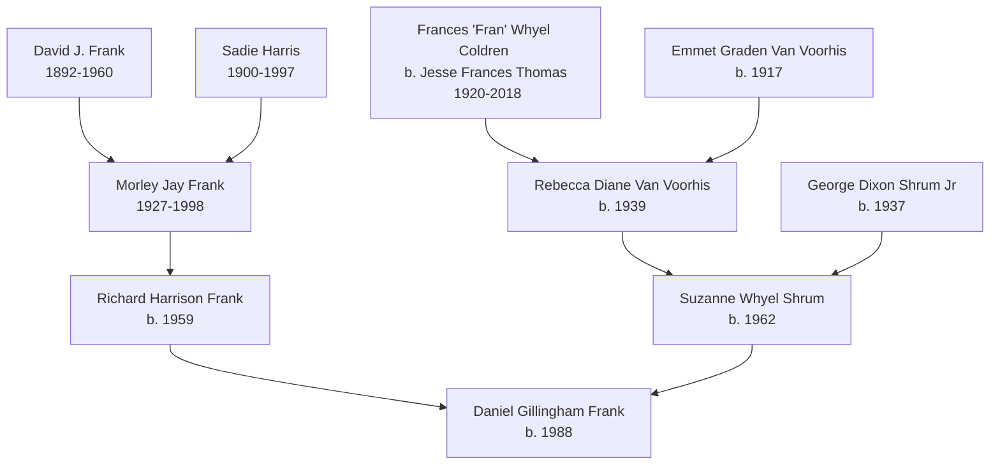

# Family Tree

The documentary genealogical record of Dan Frank's ancestry, derived from an Ancestry.com GEDCOM file containing 515 individuals, establishes a deep regional concentration in Fayette County, Pennsylvania, and traces a dual heritage: maternal Appalachian roots and a paternal Eastern European Jewish immigrant lineage.

## Immediate Family Table

| Relation | Name | Birth/Death | Place | Wiki Link |
|---|---|---|---|---|
| Self | Daniel Gillingham Frank | 1988-11-01 | Uniontown, Fayette, PA | — |
| Father | Richard Harrison "Rick" Frank | 1959-05-22 | Uniontown, PA | [[wiki/people/rick-frank]] |
| Mother | Suzanne Whyel /Shrum/ Frank ("Suz") | 1962-09-15 | Pittsburgh, PA | [[wiki/people/suzanne-frank]] |
| Sister | Vanessa C. Frank | 1994-01-16 | Greensburg, PA | [[wiki/people/vanessa-frank]] |
| Paternal Grandfather | Morley Jay Frank | 1927-08-20 – 1998-12-13 | Brownsville – Hopwood, PA | [[wiki/people/morley-frank]] |
| Paternal Great-Grandfather | David J. Frank | 1892-08-12 – 1960-04-06 | Russia – Brownsville, PA | [[wiki/people/david-j-frank]] |
| Paternal Great-Grandmother | Sadie Harris | 1900-12-14 – 1997-11-27 | Austria – Hopwood, PA | [[wiki/people/sadie-harris]] |
| Maternal Great-Grandmother | Frances "Fran" Whyel Coldren (b. Jesse Frances **Thomas**) | 1920-08-15 – 2018-04-04 | Fort Martin, WV – Uniontown, PA | [[wiki/people/fran-coldren]] |
| Maternal Great-Grandfather | Emmet Graden Van Voorhis (Fran's **first** husband) | 1917-08-01 | Dilliner, PA | — |
| Maternal Grandmother | Rebecca Diane Van Voorhis ("Diane") — **Fran's daughter** | 1939-01-30 | West Virginia | [[wiki/people/diane-shrum]] |
| Maternal Grandfather | George Dixon Shrum Jr (married *into* the line) | 1937-06-14 | Pittsburgh, PA | — |

## Paternal Jewish Immigrant Heritage

David J. Frank (b. 1892, Russia) and Sadie Harris (b. 1900, Austria) immigrated to the US and settled in Pennsylvania, forming the paternal line: David J. Frank + Sadie Harris → Morley → Rick → Dan. This structural record confirms the core biographical context: "Paternal line Jewish; father Episcopalian, mother Presbyterian. Jewish heritage is load-bearing to his politics."

## Geographic/Residence Patterns

The family history demonstrates a heavy residential concentration in Fayette County (Uniontown, Brownsville, Hopwood, Champion) across generations. The paternal grandfather, Morley, lived in Brownsville (1930-1945), relocated briefly to Seattle (1957), and then moved back to Hopwood/Champion. Dan's father, Rick, lived in Uniontown from 1989 to 2002. On the maternal side, Fran's trajectory started with West Virginia origins (1920) before shifting to Pennsylvania: the April 1940 census places her, her first husband Emmet Van Voorhis and their infant daughter Diane together in **Smithfield, Fayette County**, which dates the maternal line's arrival in the county it never leaves. Diane herself is the line's one documented departure — Farmington Hills, Michigan, 1985–2010.

> **CORRECTED [2026-08-02] — the maternal line ran through the wrong
> grandparent.** This page previously drew Fran's descent to Dan through
> **George Dixon Shrum Jr.**, the maternal grandfather. Read directly from the
> GEDCOM's family records (`Daniel Frank family tree.txt`), it is the other
> way round: Fran's only recorded child is **Rebecca Diane Van Voorhis**, born
> 1939 to Fran and her first husband **Emmet Graden Van Voorhis** — Dan's
> maternal *grandmother*. George Shrum Jr. is a Shrum by birth, with his own
> parents (G Dixon Shrum and Erma K Shrum), and married into the line. The
> consequence is not cosmetic: the Whyel coal money, the Coldren legal
> connection, the estate that produced Dan's 2020 distribution, and the "Whyel"
> Suz carries as a middle name all descend through the grandmother, not the
> grandfather. The same records give Fran's maiden name as **Thomas** and
> identify her first husband, closing two gaps
> [[wiki/people/fran-coldren]] had carried since 2026-08-01. See
> [[wiki/people/diane-shrum]].

> **REVISED [2026-07-14]:** An earlier pass here inferred that a 2025-09-03 message ("eat n' park delivered frownie cookies to my granfather's funeral i swear to god lmao") referred to George's death around that date, since he was the only grandfather without a recorded death date. Confirmed by Dan to be wrong: the message references Morley Frank's 1998 funeral, recounted in an essay by Dan's cousin Alex Frank — the auto-extracted calendar dated the entry to when Dan referenced the essay (2025), not when the funeral happened (1998). George Dixon Shrum Jr's death date remains genuinely unknown.

## Gaps
- George Dixon Shrum Jr's exact death date remains unknown and undocumented in the current GEDCOM export.
- Full accounting of collateral relatives beyond the direct lineage.
